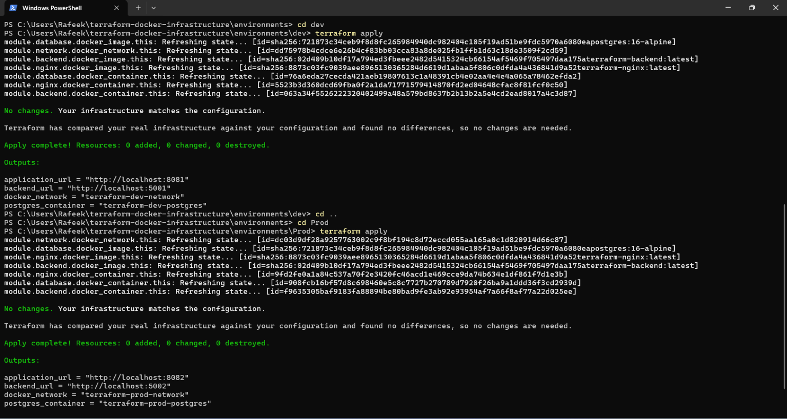
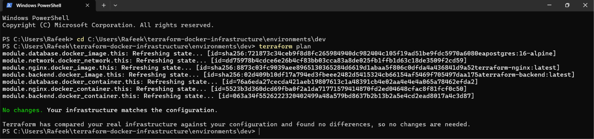
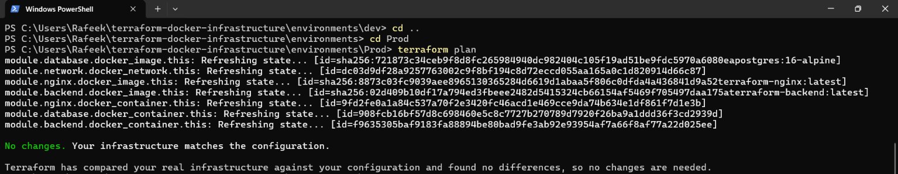
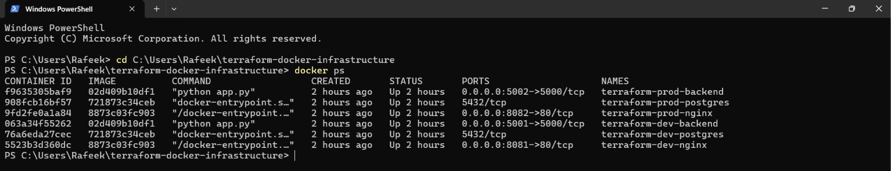
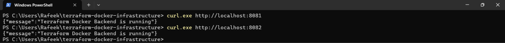
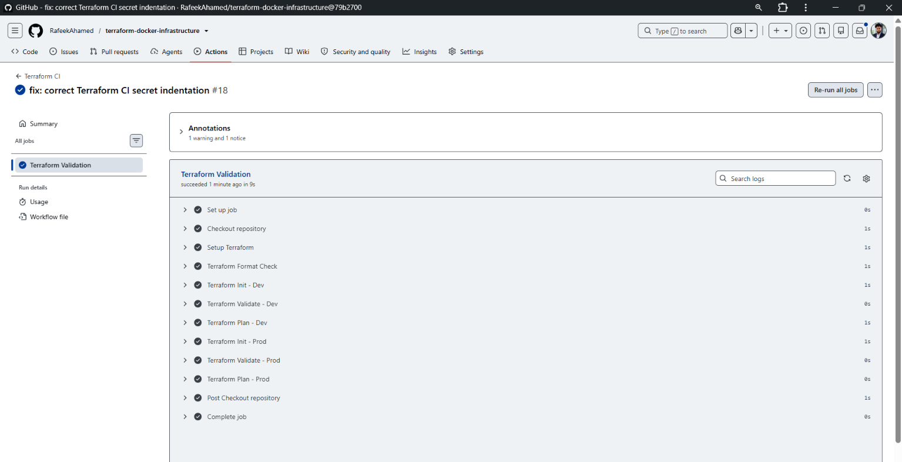

# 🚀 Terraform + Docker Infrastructure Automation

A hands-on **Infrastructure as Code (IaC)** project using **Terraform and Docker** to provision, manage, and validate a multi-container application stack across isolated **Development** and **Production** environments.

The project demonstrates practical DevOps capabilities including **Terraform modules, Docker networking, container provisioning, environment separation, Nginx reverse proxy configuration, Flask, PostgreSQL, Git, and GitHub Actions CI**.

---

## 📌 Project Overview

This project uses Terraform to provision a complete application stack locally with Docker.

Each environment contains:

- Nginx reverse proxy
- Flask backend API
- PostgreSQL database
- Dedicated Docker network
- Terraform-managed containers
- Environment-specific configuration

### Key Features

- Infrastructure as Code using Terraform
- Reusable Terraform modules
- Dev / Prod environment separation
- Isolated Docker networks
- Automated Docker image builds
- Docker container provisioning through Terraform
- Flask REST API
- PostgreSQL database
- Nginx reverse proxy
- Sensitive variable handling
- Terraform outputs
- Terraform state management
- GitHub Actions CI validation
- Infrastructure plan verification
- Local deployment without cloud infrastructure costs

---

# 🏗️ Architecture

```text
                         ┌──────────────────────┐
                         │   GitHub Repository   │
                         └──────────┬───────────┘
                                    │
                                    ▼
                         ┌──────────────────────┐
                         │   GitHub Actions CI  │
                         └──────────┬───────────┘
                                    │
                                    ▼
                         ┌──────────────────────┐
                         │    Terraform IaC     │
                         └──────────┬───────────┘
                                    │
                    ┌───────────────┴───────────────┐
                    │                               │
                    ▼                               ▼
           ┌─────────────────┐             ┌─────────────────┐
           │       DEV       │             │      PROD       │
           │  Docker Network │             │  Docker Network │
           └────────┬────────┘             └────────┬────────┘
                    │                               │
              ┌─────┼─────┐                   ┌─────┼─────┐
              ▼     ▼     ▼                   ▼     ▼     ▼
            Nginx Flask PostgreSQL          Nginx Flask PostgreSQL
             :8081 :5001                    :8082 :5002
```

### Application Flow

```text
Client
  │
  ▼
Nginx Reverse Proxy
  │
  ▼
Flask Backend API
  │
  ▼
PostgreSQL Database
```

---

# 🔀 Environment Separation

Development and Production use separate Docker networks.

## 🔵 Development

```text
Network: terraform-dev-network

Nginx      → localhost:8081
Backend    → localhost:5001
PostgreSQL → Internal Docker network
```

## 🟢 Production

```text
Network: terraform-prod-network

Nginx      → localhost:8082
Backend    → localhost:5002
PostgreSQL → Internal Docker network
```

This provides logical network isolation between the two environments.

---

# 🧩 Terraform Modules

The infrastructure is organized into reusable Terraform modules.

## Network Module

Creates the Docker network for each environment.

```text
Dev  → terraform-dev-network
Prod → terraform-prod-network
```

## Backend Module

Builds and provisions the Flask backend container.

```text
Container port: 5000

Dev  → localhost:5001
Prod → localhost:5002
```

## Database Module

Provisions PostgreSQL using:

```text
postgres:16-alpine
```

The database is connected to the environment-specific Docker network.

## Nginx Module

Builds and provisions the Nginx reverse proxy.

```text
Dev  → localhost:8081
Prod → localhost:8082
```

Nginx forwards application requests to the Flask backend over the Docker network.

---

# 🛠️ Technology Stack

| Technology | Purpose |
|---|---|
| Terraform | Infrastructure as Code |
| Docker | Containerization |
| Docker Provider | Terraform Docker resource management |
| Python | Backend |
| Flask | REST API |
| PostgreSQL | Database |
| Nginx | Reverse Proxy |
| HCL | Terraform configuration |
| Git | Version Control |
| GitHub | Source Control |
| GitHub Actions | CI Validation |
| PowerShell | CLI / Automation |

---

# 📁 Project Structure

```text
terraform-docker-infrastructure/
│
├── .github/
│   └── workflows/
│       └── terraform-ci.yml
│
├── backend/
│   ├── app.py
│   ├── Dockerfile
│   └── requirements.txt
│
├── docs/
│   ├── architecture.md
│   └── images/
│       ├── terraform-apply-success.png
│       ├── terraform-dev-plan.png
│       ├── terraform-prod-plan.png
│       ├── docker-containers.png
│       ├── application-testing.png
<<<<<<< HEAD
<<<<<<< HEAD
│       │── github-repository.png
=======
|       |── github-actions-ci.png
>>>>>>> 4b6a53e (fix: correct Terraform CI secret indentation)
=======
|       |── github-repository.png
>>>>>>> f5ba4df (fix: correct Terraform CI secret indentation)
│       └── github-actions-ci.png
│
├── environments/
│   ├── dev/
│   │   ├── main.tf
│   │   ├── output.tf
│   │   ├── providers.tf
│   │   ├── terraform.tfvars.example
│   │   ├── variables.tf
│   │   └── versions.tf
│   │
│   └── prod/
│       ├── main.tf
│       ├── output.tf
│       ├── providers.tf
│       ├── terraform.tfvars.example
│       ├── variables.tf
│       └── versions.tf
│
├── modules/
│   ├── backend/
│   ├── database/
│   ├── network/
│   └── nginx/
│
├── nginx/
│   ├── Dockerfile
│   └── nginx.conf
│
├── .gitignore
├── .terraform.lock.hcl
├── README.md
└── terraform.tfvars.example
```

---

# 📸 Project Screenshots

## Terraform Apply

Terraform successfully provisions the Docker infrastructure.



---

## Terraform Plan — Development

The Development environment was verified with Terraform plan.



Expected result:

```text
No changes. Your infrastructure matches the configuration.
```

---

## Terraform Plan — Production

The Production environment was also verified against the Terraform configuration.



Expected result:

```text
No changes. Your infrastructure matches the configuration.
```

---

## Docker Containers

The final deployment contains separate Dev and Prod application stacks.



Expected services:

```text
Development
├── terraform-dev-nginx
├── terraform-dev-backend
└── terraform-dev-postgres

Production
├── terraform-prod-nginx
├── terraform-prod-backend
└── terraform-prod-postgres
```

**Total: 6 Docker containers**

---

## Application Testing

Both Dev and Prod application endpoints are tested through Nginx.



```text
Development → http://localhost:8081
Production  → http://localhost:8082
```

Expected response:

```json
{
  "message": "Terraform Docker Backend is running"
}
```

---

## GitHub Actions CI

Terraform configuration is validated automatically through GitHub Actions.



---

# 🚀 Getting Started

## Prerequisites

Install:

- Docker Desktop
- Terraform
- Git
- PowerShell

Verify:

```powershell
terraform version
docker version
git --version
```

Make sure Docker Desktop is running before executing Terraform commands.

---

# 🔵 Deploy Development

Navigate to the Dev environment:

```powershell
cd C:\Users\Rafeek\terraform-docker-infrastructure\environments\dev
```

Initialize Terraform:

```powershell
terraform init
```

Format:

```powershell
terraform fmt -recursive
```

Validate:

```powershell
terraform validate
```

Create execution plan:

```powershell
terraform plan
```

Apply infrastructure:

```powershell
terraform apply
```

---

# 🟢 Deploy Production

Navigate to the Prod environment:

```powershell
cd C:\Users\Rafeek\terraform-docker-infrastructure\environments\prod
```

Initialize Terraform:

```powershell
terraform init
```

Format:

```powershell
terraform fmt -recursive
```

Validate:

```powershell
terraform validate
```

Create execution plan:

```powershell
terraform plan
```

Apply:

```powershell
terraform apply
```

---

# 🧪 Verification

## Check Containers

```powershell
docker ps
```

Expected:

```text
terraform-dev-nginx
terraform-dev-backend
terraform-dev-postgres

terraform-prod-nginx
terraform-prod-backend
terraform-prod-postgres
```

## Check Networks

```powershell
docker network ls
```

Expected:

```text
terraform-dev-network
terraform-prod-network
```

## Test Development

```powershell
curl.exe http://localhost:8081
```

Expected:

```json
{
  "message": "Terraform Docker Backend is running"
}
```

## Test Production

```powershell
curl.exe http://localhost:8082
```

Expected:

```json
{
  "message": "Terraform Docker Backend is running"
}
```

---

# 🔍 Infrastructure Validation

The project uses Terraform to compare the declared configuration with the deployed infrastructure.

### Format

```powershell
terraform fmt -check -recursive
```

### Validate

```powershell
terraform validate
```

### Plan

```powershell
terraform plan
```

A synchronized environment returns:

```text
No changes. Your infrastructure matches the configuration.
```

This verifies that the deployed Docker infrastructure matches the Terraform configuration.

---

# ⚙️ GitHub Actions CI

Workflow:

```text
.github/workflows/terraform-ci.yml
```

The CI pipeline performs Terraform configuration validation for the Dev and Prod environments.

### CI Flow

```text
GitHub
   │
   ▼
Checkout
   │
   ▼
Terraform Setup
   │
   ▼
terraform fmt -check
   │
   ├───────────────┐
   ▼               ▼
  DEV             PROD
   │               │
   ├─ init         ├─ init
   ├─ validate     ├─ validate
   └─ plan         └─ plan
```

The workflow provides automated Terraform validation before changes are merged.

---

# 🔐 Security & Configuration

Sensitive configuration is kept outside committed source code.

## `.tfvars`

Actual Terraform variable files are ignored through `.gitignore`.

Only example configuration is committed:

```text
terraform.tfvars.example
```

## Terraform State

Terraform state files are excluded from Git.

For a production cloud implementation, remote state with secure access control, encryption, and state locking would be recommended.

## Database Network Security

PostgreSQL is connected to the internal Docker network and is not directly exposed through a host port.

---

# 📊 Validation Results

The project has been validated through:

```text
✓ Terraform fmt
✓ Terraform validate
✓ Terraform plan
✓ Terraform apply
✓ Docker container verification
✓ Docker network verification
✓ Container DNS resolution
✓ Nginx configuration validation
✓ Development HTTP testing
✓ Production HTTP testing
✓ GitHub Actions CI
```

### Current Deployment

```text
Development
├── Nginx
├── Flask Backend
└── PostgreSQL

Production
├── Nginx
├── Flask Backend
└── PostgreSQL
```

**6 Docker containers successfully provisioned and running.**

Terraform plan verification confirms:

```text
No changes. Your infrastructure matches the configuration.
```

---

# 🧠 DevOps Skills Demonstrated

- Infrastructure as Code
- Terraform
- Terraform Modules
- Terraform Provider
- HCL
- Docker
- Docker Networking
- Container Provisioning
- Dev / Prod Environment Separation
- Nginx Reverse Proxy
- Flask REST API
- PostgreSQL
- Environment Variables
- Sensitive Variables
- Terraform Outputs
- Terraform State
- Infrastructure Validation
- Git
- GitHub
- GitHub Actions
- CI/CD
- PowerShell

---

# 🔮 Future Improvements

Potential extensions:

- Remote Terraform state
- State locking
- Dedicated secret management
- Container image versioning
- Container health checks
- Terraform linting
- Trivy image security scanning
- Prometheus / Grafana monitoring
- Automated deployment pipelines
- Azure infrastructure provisioning with Terraform
- Azure Container Registry
- Azure Kubernetes Service (AKS)

---

# 👨‍💻 Author

## Rafeek Ahamed M

**DevOps Engineer | Azure Cloud Engineer**

**GitHub:**  
https://github.com/RafeekAhamed

**LinkedIn:**  
https://linkedin.com/in/rafeek-ahamed-devops

---

# ⭐ Repository

**Terraform + Docker Infrastructure Automation**

https://github.com/RafeekAhamed/terraform-docker-infrastructure

A hands-on DevOps project demonstrating practical **Terraform Infrastructure as Code, Docker containerization, networking, environment management, CI validation, and application deployment**.
